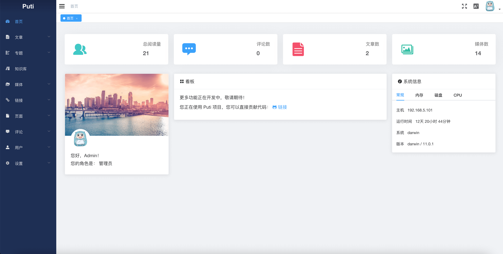
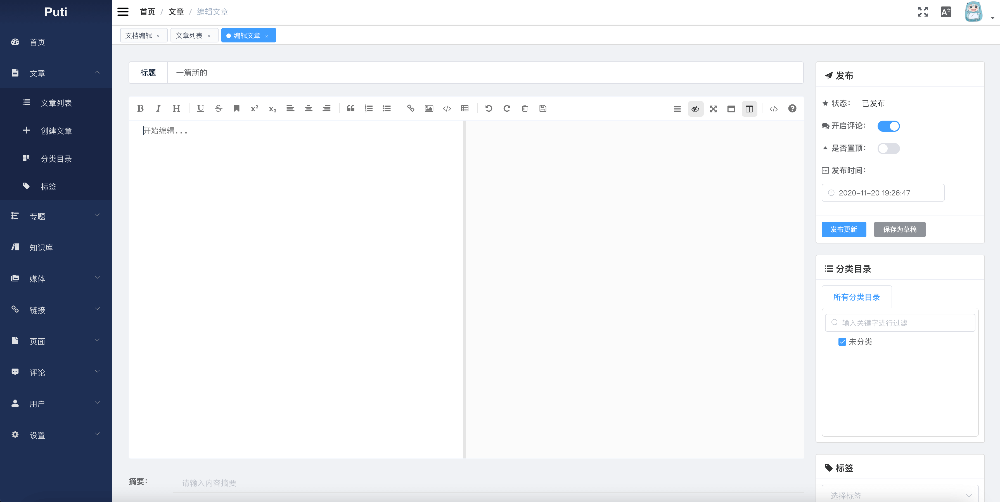

<p align="center">
    
</p>
<h1 align="center">Puti</h1>
<p align="center">
    <em>:black_nib: Puti is a blog system written in Golang.</em>
</p>

<p align="center">
    <a href="https://github.com/puti-projects/puti/actions?query=workflow%3Abuild">
        
    </a>
    <a href="https://codecov.io/gh/puti-projects/puti">
        
    </a>
    <a href="https://goreportcard.com/report/github.com/puti-projects/puti">
        
    </a>
    <a href="https://github.com/puti-projects/puti/releases">
        
    </a>
    <a href="https://github.com/puti-projects/puti/blob/master/LICENSE">
        
    </a>
</p>
<p align="center">
中文
 | <a href="https://github.com/puti-projects/puti/blob/master/README_EN.md">Engilsh</a>
</p>

## 状态

Puti 项目现在仍在开发中，目标是面向极客的下一代写作系统。

## 环境依赖

- Golang 1.13+ (Build using modules)
- MySQL
  
本项目使用了 Go Modules，所以建议使用 Go 1.13 以上版本；项目不依赖 Nginx 之类的 Web Server, 但是你可以配置并且使用 Nginx。

## 功能与计划

项目计划实现以及已经实现的功能如下：

* [ ] 功能
  * [x] 用户
  * [ ] 登录注册
    * [x] 登录
    * [ ] 注册
    * [ ] 第三方接入（github等）
  * [x] 博文系统
    * [x] 文章
    * [x] 页面
    * [x] 分类
    * [x] 标签
    * [x] 专题
  * [x] 知识库系统
    * [x] 笔记本
    * [x] 文档集
  * [x] 媒体
  * [ ] 链接
  * [ ] 评论
  * [ ] 设置
    * [x] 普通设置
    * [ ] 第三方设置（接入GItHub，WeChat等）
  * [ ] 主题
    * [X] 主题支持
    * [X] 默认主题（Emma）
    * [X] 自由切换 
    * [ ] 管理界面直接修改主题模板文件
  * [ ] 邮件
    * [ ] 邮件配置
    * [ ] 邮件发送
* [ ] 技术支持 
  * [ ] 完善的 i18n 
  * [ ] 邮件服务配置
  * [ ] TOC (目前在前端主题实现)
  * [ ] 配置图片裁切
  * [X] HTTPS（支持自动 HTTPS）
  * [x] WebServer 转发
  * [ ] 头像接入
  * [ ] OAuth 
  * [ ] 媒体文件云存储
* [ ] 生态
  * [x] Docker 镜像支持
  * [x] 配置化的自动部署脚本  
  * [ ] 简单的统计系统

## 截图





## 快速开始

### 配置

Puti 的配置文件位于 `configs` 下的 `config.yaml`，初次使用可以从 `config.yaml.example` 初始化配置文件。  
需要注意的配置：

| 配置 | 说明 |
| :----- | :----- | 
| server.http_port |  HTTP 端口 |
| server.https_open |  是否开启 HTTPS  |
| server.auto_cert |  是否开启自动 HTTPS  |
| server.https_port |  HTTPS 端口  |
| server.tls_cert | 如果不是自动 HTTPS，配置 SSL 证书路径   |
| server.tls_key |  如果不是自动 HTTPS，配置 SSL 私钥路径  |
| safety.jwt_secret |  Json web token 秘钥 |
| db.name |  数据库名称  |
| db.addr |  数据库 HOST:PORT  |
| db.username |  数据库登录名  |
| db.password |  数据库密码  |

### 安装

#### 源码安装

项目使用了 Go Module，所以要求 Go 1.13 及以上的版本。目前移除了 Vendor 目录，因为现在 `go proxy` 已经能够很好地解决某些问题了。

```sh
# 下载
$ go get -u github.com/puti-projects/puti

# 使用Makefile来构建程序
$ cd $GOPATH/src/github.com/puti-projects/puti
$ make
```

#### 使用 Docker

##### 使用现成的镜像

我们已经提供了现成的镜像，可以直接拉取使用：

```sh
# 从 Docker Hub 拉取镜像
$ docker pull puti/puti

# 创建需要挂载的目录，例如：`/data/puti`为应用文件存放目录，`/data/logs/puti`为日志存放目录
$ mkdir -p /data/puti /data/logs/puti

# 第一次通过`docker run`来创建一个容器
$ docker run --name=puti -p 80:8000 -p 443:8080 -v /data/puti:/data/puti -v /data/logs/puti:/data/logs/puti puti/puti

# 使用 `docker stop``docker start`来停止，关闭容器。
$ docker stop puti
$ docker start puti
```

更多内容查看：[Docker use](./scripts/docker/README.md)

##### 使用可配置的部署脚本

我们提供了简单方便地一键部署 Docker-compose 脚本文件，懒人必备。具体使用查看：[puti-projects/puti-environment](https://github.com/puti-projects/puti-environment)

### 使用
初始化失败，可能是数据库配置的问题（目前没有安装引导）。默认初始化一个账号 `admin` 密码 `admin` 的默认账号，请创建自己的账号后移除默认账号。功能完善后会考虑安装引导。

## 主题

更多主题制作中。目前提供默认主题 Emma 和 Lin，为两种不同风格的主题。

## 文档

TODO

## 更新日志

Detailed changes for each release are documented in the [changelog file]((https://github.com/axetroy/vscode-gpm/blob/master/CHANGELOG.md)).

## 依赖

| 依赖 | 关于 |
| :----- | :----- |
| [gin-gonic/gin](https://github.com/gin-gonic/gin) |  HTTP web framework written in Go. |
| [go-gorm/gorm](https://github.com/go-gorm/gorm)  | The ORM library for Golang. |
| [allegro/bigcache](https://github.com/allegro/bigcache) | Efficient cache for gigabytes of data written in Go. |
| [spf13/viper](https://github.com/spf13/viper) |  Complete configuration solution. |
| [go.uber.org/zap](https://go.uber.org/zap) |  Fast, structured, leveled logging. |
| [vuejs/vue](https://github.com/vuejs/vue) | JavaScript framework for building UI on the web. |
| [ElemeFE/element](https://github.com/ElemeFE/element) | A Vue.js 2.0 UI Toolkit for Web.  |
| [PanJiaChen/vue-element-admin](https://github.com/PanJiaChen/vue-element-admin) | A front-end management background integration solution. |
| [hinesboy/mavonEditor](https://github.com/hinesboy/mavonEditor) (will be removed) | A markdown editor. |
| [Vanessa219/vditor](https://github.com/Vanessa219/vditor) | An in-browser markdown editor. |
| [88250/lute](https://github.com/88250/lute) | A structured Markdown engine that supports Go and JavaScript. |

## 说明

### 部署
可以不使用 Nginx 之类的 WebServer，且支持自动 HTTPS；目前不做重定向判断，如根域名到 www 域名，HTTP 到 HTTPS；较好的实践是再加一层 WebServer。


## 贡献
<!-- ALL-CONTRIBUTORS-LIST:START - Do not remove or modify this section -->
| [<br /><sub>goozp</sub>](https://www.goozp.com)<br />[💻](https://github.com/puti-projects/puti/commits?author=goozp "Code commitor")[📚](https://github.com/dawnlabs/carbon/commits?author=briandennis "Documentation")[🎨](#design "Design") |
| :---: |

<!-- ALL-CONTRIBUTORS-LIST:END -->

## License 

Puti is under the GPL-3.0 license. See the [LICENSE](https://github.com/puti-projects/puti/blob/master/LICENSE) file for details.
